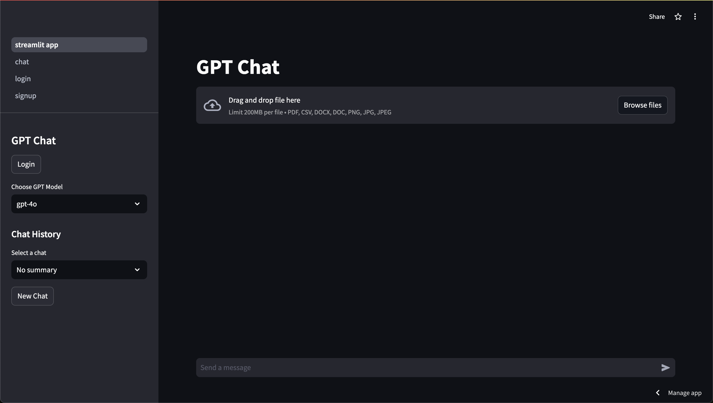
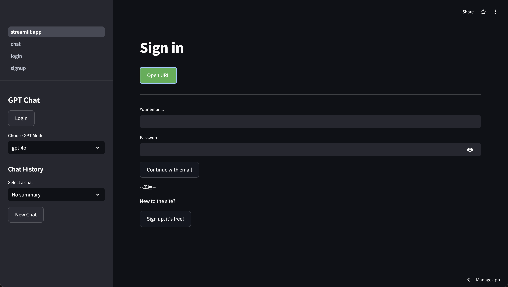
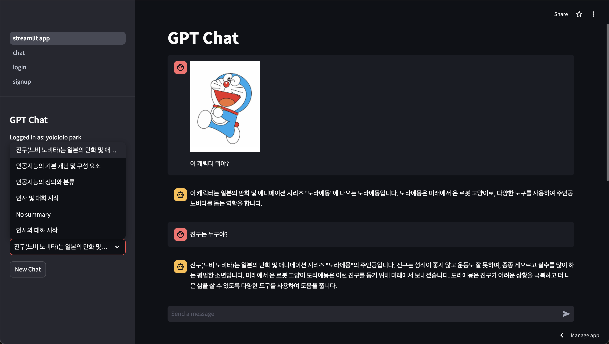
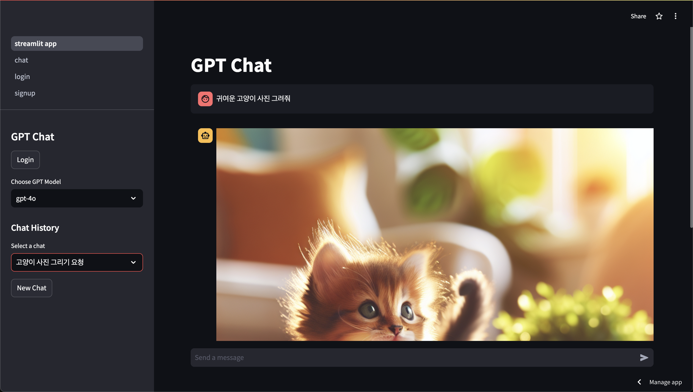

# GPT Chat with DALL-E Integration

This project is a Streamlit-based web application that provides a chat interface powered by OpenAI's GPT and DALL-E APIs. Users can interact with the chatbot to generate both text and images in a seamless conversation experience. The application also supports file uploads, which can be used as part of the conversation.

## Features

- **Natural Language Processing**: Powered by OpenAI's GPT, the chatbot can handle a wide range of queries and conversations.
- **Image Generation**: Using the DALL-E API, the bot can generate images based on user prompts during the conversation.
- **File Upload**: Users can upload files such as PDFs, CSVs, Word documents, and images to the chat, which the bot can process and respond to accordingly.
- **Chat History**: The application saves chat history, allowing users to revisit previous conversations.

## Project Structure

```
.
├── README.md
├── __pycache__
│   ├── firebase_config.cpython-310.pyc
│   └── openai_api.cpython-310.pyc
├── client_secret.json
├── firebase_config.py
├── gpt-chating-c72cacf446d4.json
├── img
│   ├── chat_page.png
│   ├── login_google.png
│   ├── picture_chat.png
│   └── picture_generation.png
├── openai_api.py
├── modules
│   ├── __pycache__
│   │   ├── chat.cpython-310.pyc
│   │   ├── home.cpython-310.pyc
│   │   ├── login.cpython-310.pyc
│   │   └── signup.cpython-310.pyc
│   ├── chat.py
│   ├── login.py
│   └── signup.py
├── requirements.txt
├── streamlit_app.py
└── utils
    ├── __pycache__
    │   ├── auth.cpython-310.pyc
    │   ├── firestore.cpython-310.pyc
    │   └── session.cpython-310.pyc
    ├── auth.py
    └── firestore.py

7 directories, 25 files
```

- `streamlit_app.py`: Main entry point for the Streamlit application.
- `openai_api.py`: Contains functions to interact with OpenAI's GPT and DALL-E APIs.
- `modules/`: Contains different page modules for the Streamlit multipage setup (`chat.py`, `login.py`, `signup.py`).
- `img/`: Contains screenshots of the application.
- `utils/`: Contains utility functions for authentication and Firestore database interactions.

## Setup and Installation

### Prerequisites

- Python 3.10+
- Streamlit
- OpenAI API key
- Firebase credentials for authentication and Firestore

### Installation

1. Clone the repository:

   ```bash
   git clone https://github.com/your-repo/gpt-chat-dalle.git
   cd gpt-chat-dalle
   ```

2. Create and activate a virtual environment:

   ```bash
   python3 -m venv venv
   source venv/bin/activate  # On Windows use `venv\Scriptsctivate`
   ```

3. Install the required packages:

   ```bash
   pip install -r requirements.txt
   ```

4. Set up environment variables for the OpenAI API key and Firebase credentials:

   - Create a `.env` file in the root directory with the following content:

     ```env
     OPENAI_API_KEY=your-openai-api-key
     FIREBASE_CREDENTIALS_PATH=path-to-your-firebase-credentials.json
     ```

5. Run the application:

   ```bash
   streamlit run streamlit_app.py
   ```

6. Access the application locally at `http://localhost:8501` or visit the deployed version at:

   [Deployed Application](https://quizgen-ai.streamlit.app)

## Usage

- **Chat**: Start a conversation by typing into the chat input box and hitting enter.
- **Generate Images**: Describe an image in your message, and the bot will automatically detect and generate an image using the DALL-E API.
- **Upload Files**: Click the file upload button next to the chat input to upload documents or images. The bot will process these files and include the content in the conversation.

## Screenshots

### Chat Interface



### Google Login



### Image in Chat



### Picture Generation Example



## License

This project is licensed under the MIT License - see the [LICENSE](LICENSE) file for details.
